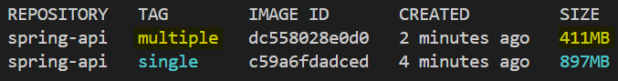
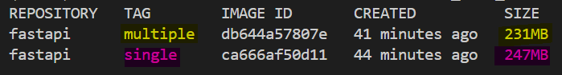

# Docker Demo: Multi-Stage Build

- [Docker Demo: Multi-Stage Build](#docker-demo-multi-stage-build)
  - [Project Overview](#project-overview)
  - [Result](#result)
    - [Spring Boot](#spring-boot)
    - [FastAPI](#fastapi)
    - [Why Spring Boot Gains More](#why-spring-boot-gains-more)
  - [Key Concept: Multi-Stage Build](#key-concept-multi-stage-build)

---

## Project Overview

- This project demonstrates the benefit of **multi-stage Docker builds** by comparing `single-stage` and `multi-stage` images across two different backend frameworks — **`Spring Boot`** and **`FastAPI`**.
- The goal is to show **how multi-stage builds reduce final image size** by separating the build environment from the runtime environment, and to illustrate that the size savings depend heavily on how much the build tooling weighs.

---

## Result

### Spring Boot

| Build Type     | Tag                   | Size        |
| -------------- | --------------------- | ----------- |
| Single-stage   | `spring-api:single`   | 897 MB      |
| Multi-stage    | `spring-api:multiple` | 411 MB      |
| **Difference** |                       | **−486 MB** |



---

### FastAPI

| Build Type     | Tag                | Size       |
| -------------- | ------------------ | ---------- |
| Single-stage   | `fastapi:single`   | 247 MB     |
| Multi-stage    | `fastapi:multiple` | 231 MB     |
| **Difference** |                    | **−16 MB** |



---

### Why Spring Boot Gains More

The size reduction depends on how heavy the build tooling is relative to the runtime.

| Framework   | Builder Image                              | Runtime Image            | What Gets Discarded                        |
| ----------- | ------------------------------------------ | ------------------------ | ------------------------------------------ |
| Spring Boot | `maven:3.9.9-eclipse-temurin-17` (~600 MB) | `eclipse-temurin:17-jre` | Full Maven, JDK, source files, build cache |
| FastAPI     | `python:3.12-slim`                         | `python:3.12-slim`       | pip download cache only                    |

- **Spring Boot**
  - **the builder stage**: carries **a full `JDK` and the `Maven` build tool** — neither is needed at runtime.
  - **multi-stage build**: discards both, replacing them with a slim `JRE-only` image.
  - This accounts for the ~486 MB saving.
- **FastAPI**
  - uses the **same slim base image in both stages**
  - its dependencies (`fastapi`, `uvicorn`) ship as **pre-built wheels with no compilation step**.
  - There are almost no build artifacts to discard, so the saving is small (~16 MB from the pip download cache).

> The general rule: **the heavier the build tooling, the more multi-stage builds help.**

---

## Key Concept: Multi-Stage Build

- `multi-stage build`
  - uses **multiple `FROM` instructions** in a single `Dockerfile`.
  - Each `FROM` starts a new stage with its own base image. Files can be selectively copied from one stage to the next using `COPY --from=<stage>`.

- **Key Steps for both `Spring Boot` and `FastAPI`**

| Step                                                     | Purpose                                                             |
| -------------------------------------------------------- | ------------------------------------------------------------------- |
| Choose a **builder base** with all required build tools  | Ensures the app compiles or packages correctly                      |
| **Build the application** inside the builder stage       | Produces a self-contained **artifact** (`.jar`, installed packages) |
| Choose a minimal **runtime base image**                  | Keeps the final image free of build tooling                         |
| Copy **only the output artifact** into the runtime stage | Nothing from the builder leaks into the final image                 |

```txt
Stage 1 — Builder
├── Start from a full build environment (compiler, package manager, SDK, etc.)
├── Copy source code
├── Compile / package the application
└── (entire stage is discarded after the build)

Stage 2 — Runtime
├── Start from a lean base image (no build tools)
├── COPY --from=builder <artifact> → runtime location
└── Run the application
```

> The result is a final image that contains **only what is needed to run** the application — not what was needed to build it.
